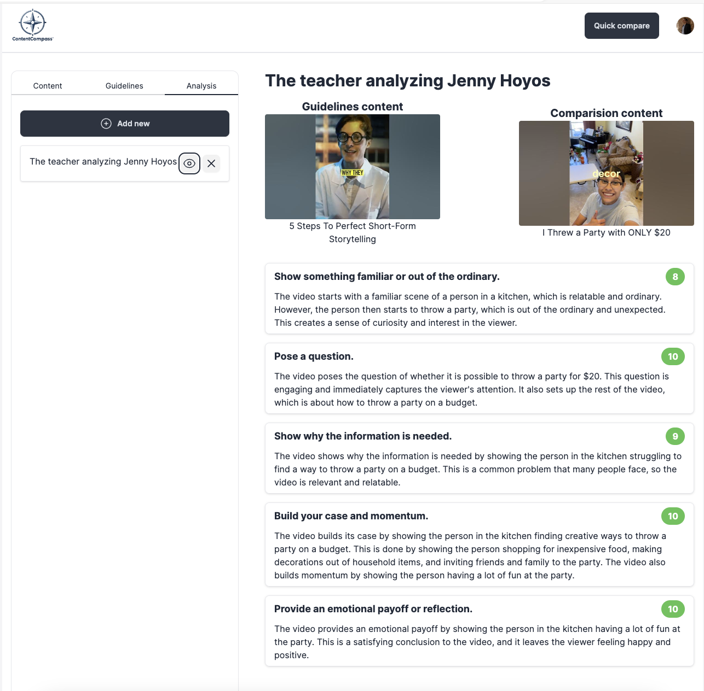

# contentcompass

Content Compass is an innovative Al-powered tool designed to revolutionize the way you align videos with your specific content guidelines. Whether you're a marketer, educator, content creator, or business professional, Content Compass offers you a seamless way to ensure your content not only meets but exceeds your desired standards. Input guidelines through text or directly from a YouTube video, and let our advanced Gemini Al do the rest.

# Quickstart
backend:
cd app
uvicorn main:app --reload

frontend:
npm run dev